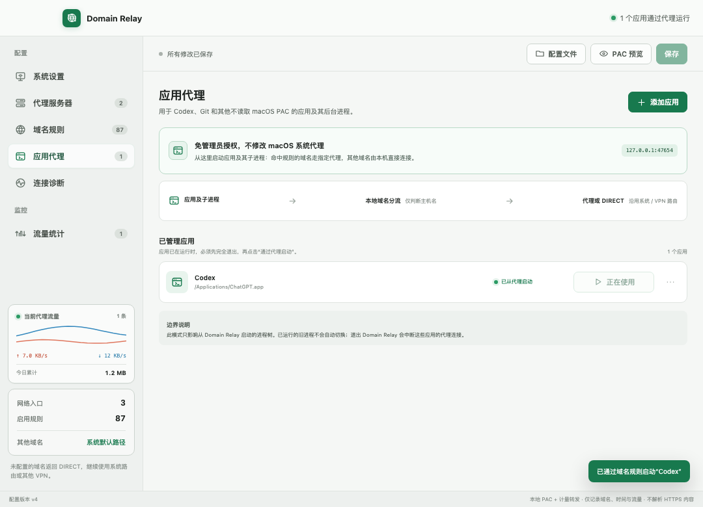

# Domain Relay

[](https://github.com/359587/DomainRelay/actions/workflows/ci.yml)
[](LICENSE)
[](https://www.apple.com/macos/)

Domain Relay 是一个面向 macOS 的本地域名代理管理器。它把用户维护的域名和代理出口生成成 PAC 文件，只改写明确配置的域名；所有未匹配域名返回 `DIRECT`，继续交给 macOS 当前路由表处理。

这意味着它通常可以与通过路由表接管流量的企业 VPN 共存，不需要实现或安装新的 VPN/TUN 内核。

> A local macOS PAC manager for routing selected domains and explicitly launched apps through configurable HTTP, HTTPS, or SOCKS5 proxies.



## 当前能力

- 管理多个 HTTP、HTTPS 或 SOCKS5 代理出口。
- 将不同域名映射到不同代理，并允许每条规则单独选择“主域名 + 子域名”或“仅此域名”。
- 支持粘贴或读取 `.txt` 批量导入域名，并在导入前预览匹配方式。
- 仅在 `127.0.0.1` 上提供 PAC 和计量转发代理，不监听局域网地址。
- 可选择 Codex 等 macOS 应用并从 Domain Relay 启动，为应用及其子进程注入本地代理环境，覆盖不读取系统 PAC 的网络栈。
- 应用代理模式下，未命中域名由本地转发器直接连接，仍沿用 macOS 路由表或路由型 VPN。
- 同时选择一个或多个要修改的 macOS 网络服务，并分别配置 PAC 与流量转发端口。
- 实时显示代理上下行速率、活动连接和最近经过代理的具体域名。
- 按域名汇总今天、近 7 天、近 30 天或全部历史，并保留最近 90 天连接记录。
- 应用前备份全部所选网络服务原有的自动代理状态。
- 对每个 HTTP、HTTPS 或 SOCKS5 代理执行真实连通性测试，并显示延迟或认证要求。
- 系统设置、代理服务器和域名规则使用独立页签，长列表只滚动当前内容页。
- 自动识别并标记当前默认网络入口，避免选中名称相近但未承载流量的网卡。
- 连接诊断会逐项检查当前入口、PAC、域名规则和目标域名代理隧道。
- 单实例运行，避免多个进程争用本地 PAC 端口。
- 显式恢复原设置；如果自动代理已被其他软件改写，不会强行覆盖它。
- 配置文件采用原子写入，权限固定为 `0600`。
- 菜单栏驻留；关闭窗口不会让已启用的 PAC 服务失效。
- 系统 PAC 启用后，新增或修改域名规则可通过“保存并热更新”立即刷新，新连接无需重启 Domain Relay 即可使用最新规则。
- 系统 PAC 启用时可直接关闭窗口并留在菜单栏，日常关闭无需再次授权；应用、热更新或恢复系统 PAC 时，macOS 可能请求管理员授权。
- 打包版本启用规则后会配置为登录时启动，恢复后取消。

## 更新日志

> 维护约定：以后每次向 `main` 提交新功能、行为修复、兼容性、安装或安全相关更新时，都在同一提交中同步更新本节。完整版本记录见 [CHANGELOG.md](CHANGELOG.md)。

### 2026-08-31

- **PAC 域名规则热更新**（[`4ebaa83`](https://github.com/359587/DomainRelay/commit/4ebaa8306d1bd90bcdab586ade030492ef4e3d4c)）：已启用系统 PAC 时，保存新增、删除、启停、域名或匹配范围变化会生成新的内容指纹地址并刷新 macOS 自动代理；增加刷新结果校验、失败回滚以及新旧 PAC 地址的安全恢复。

### 2026-08-29

- **刷新正式应用图标**（[`99f56fb`](https://github.com/359587/DomainRelay/commit/99f56fbc3b21391377a7f7458a646892abb8192c)）：更新路由分流主题的 SVG、ICNS 和全套 macOS iconset，统一应用在不同尺寸下的正式图标。

### 2026-08-26

- **补充未签名 macOS 安装指南**（[`7ba53bc`](https://github.com/359587/DomainRelay/commit/7ba53bcff201cb76601bda156ae44b9d23825af2)）：增加源码构建、DMG 安装、Gatekeeper “仍要打开”流程和可信来源下的隔离属性处理说明。
- **首次开源 `v0.5.2`**（[`1ea45a3`](https://github.com/359587/DomainRelay/commit/1ea45a3362947d453d44a04301557b019abe470e)，[Release](https://github.com/359587/DomainRelay/releases/tag/v0.5.2)）：提供多代理与域名分流、批量规则导入、应用代理启动、实时与历史流量统计、连接诊断、多网络服务状态备份与安全恢复，以及 loopback 监听、原子配置写入和 `0600` 文件权限等安全边界。

## 工作方式

```text
遵循系统 PAC 的应用
   ├── 域名命中 ──► 127.0.0.1 计量转发 ──► 指定 HTTP / HTTPS / SOCKS5 上游代理
   └── 未命中 ────► DIRECT ─────────────► macOS 路由表 / 路由型 VPN

从 Domain Relay 启动的应用及子进程
   └── 本地显式代理 ─► 127.0.0.1 计量转发
                         ├── 域名命中 ──► 指定上游代理
                         └── 未命中 ────► DIRECT ─► macOS 路由表 / 路由型 VPN
```

PAC 是系统代理配置，不是透明代理：只有遵循 macOS 自动代理设置的应用才会使用它。计量转发器不会解密 HTTPS，只能从 CONNECT 看到目标域名并统计隧道字节。

## 安装与首次打开

当前版本尚未使用 Apple Developer ID 正式签名，也未经过 Apple 公证。macOS Gatekeeper 可能提示“Apple 无法检查是否包含恶意软件”“无法验证开发者”，并只提供“移到废纸篓”或“完成”。这是当前发布方式的已知限制，不代表已经完成安全验证。

> **安全提示**：只安装你自己从本仓库源码构建的版本，或从本项目 [GitHub Releases](https://github.com/359587/DomainRelay/releases) 获取的文件。不要对来源不明的 App 绕过 Gatekeeper。如果提示明确写着“将损坏你的电脑”或检测到恶意软件，请停止安装并提交 Issue。

### 方式一：从源码运行或构建（推荐）

```bash
git clone https://github.com/359587/DomainRelay.git
cd DomainRelay
pnpm install --frozen-lockfile
pnpm dev
```

构建适用于当前 Mac 架构的 DMG：

```bash
CSC_IDENTITY_AUTO_DISCOVERY=false pnpm package:mac
open dist
```

当前 `v0.5.2` Release 只提供 GitHub 自动生成的源码包，未发布未经签名和公证的 DMG。

### 方式二：安装 DMG

以下步骤适用于你自行构建的 DMG，以及未来 Release 页面提供的 DMG：

1. 连按打开 `.dmg` 文件。
2. 将 `Domain Relay.app` 拖入“应用程序”文件夹。
3. 推出 DMG，然后从“应用程序”文件夹打开 Domain Relay。
4. 如果首次打开被 Gatekeeper 拦截，先关闭提示，不要立即清倒废纸篓。

### 处理“移到废纸篓”或“无法验证开发者”提示

优先使用 Apple 提供的图形界面方式：

1. 先尝试打开 Domain Relay 一次，让 macOS 记录拦截结果。
2. 打开“系统设置” → “隐私与安全性”，向下滚动到“安全性”。
3. 找到 Domain Relay 的拦截提示，点按“仍要打开”。该按钮通常只会在尝试打开后的一段时间内出现。
4. 再次确认“打开”，并按系统要求输入登录密码或使用可用的系统认证方式。

Apple 的说明见[《在 Mac 上安全地打开 App》](https://support.apple.com/zh-cn/102445)。

如果“仍要打开”没有出现，并且你确认 App 是自己从本仓库构建的，或来自本项目官方 Release，可以在终端移除该 App 的下载隔离属性：

```bash
sudo xattr -rd com.apple.quarantine "/Applications/Domain Relay.app"
open "/Applications/Domain Relay.app"
```

`xattr` 只会移除 macOS 的下载隔离标记，不会为 App 补充签名、公证或恶意软件扫描。不要对来源不明的 App 执行此命令，也不要用临时重签名命令覆盖现有 App。

## 开发

要求：macOS、Node.js 22+、pnpm 10+、Xcode Command Line Tools。

```bash
pnpm install
pnpm dev
```

常用检查：

```bash
pnpm typecheck
pnpm test
pnpm build
CSC_IDENTITY_AUTO_DISCOVERY=false pnpm package:mac
```

开发版和当前产物只适合本机验证。签名限制和首次打开方法见[安装与首次打开](#安装与首次打开)。面向其他电脑正式分发前，需要配置 Apple Developer ID 完成签名和 notarization。

## 使用步骤

1. 从“应用程序”文件夹启动 Domain Relay；开发模式使用 `pnpm dev`。
2. 选择要应用 PAC 的网络服务，通常是标记为当前默认入口的 `Wi-Fi` 或有线网卡。
3. 配置一个或多个代理服务器，先点击“测试”确认代理能够连接。
4. 添加域名并选择对应代理出口；也可以点击“批量导入”，粘贴域名或选择 `.txt` 文件。
5. 首次配置保存后点击“应用到 macOS”，通过管理员授权。
6. 系统 PAC 已启用时，新增或修改域名后点击“保存并热更新”；新连接会立即使用最新规则，macOS 可能再次请求管理员授权。
7. 在“连接诊断”和“流量统计”中确认目标域名确实经过预期代理。
8. 日常关闭窗口后应用会留在菜单栏，不需要再次授权。确实要完全退出或卸载前，选择“恢复并完全退出”，macOS 会请求管理员授权并恢复原设置。

### 管理员授权与 Touch ID

- “应用到 macOS”、“保存并热更新”和“恢复系统设置”会修改系统 PAC，macOS 可能要求管理员授权；多张网卡会合并为一次授权。
- 未启用系统 PAC 时保存配置，以及测试代理、查看流量和“应用代理”模式，都不会修改系统网络设置，不需要管理员密码。
- Domain Relay 不能强制把 macOS 的管理员密码窗口改成 Touch ID。是否提供 Touch ID 由系统授权策略和公司设备管理策略决定。
- 不会保存管理员密码，也不会修改 `sudoers` 或 PAM 来实现永久免密。

### Codex 等不读取 PAC 的应用

1. 在“应用代理”中点击“添加应用”，选择 `/Applications/ChatGPT.app`。Domain Relay 会将它识别为 Codex。
2. 如果 Codex 已经运行，请先用 `Command + Q` 完全退出；仅关闭窗口不够。
3. 回到 Domain Relay，点击“通过代理启动”。新启动的 Codex 及其 `codex app-server`、Git 等子进程会使用本地域名规则。
4. 在“流量统计”中确认 `chatgpt.com`、`openai.com`、`oaiusercontent.com` 等实际目标域名出现下行流量。

应用代理不会修改目标应用文件，也不会全局写入 shell 环境。代理变量只注入本次从 Domain Relay 启动的进程树。未配置域名由本地转发器直接连接，不计入代理流量统计。

批量导入会按公共后缀智能判断规则类型：

- 主域名 `google.com` 会保存为 `*.google.com`，同时匹配 `google.com` 本身和全部子域名。
- 具体子域名 `api.google.com` 默认只匹配它自己。
- 显式输入 `*.api.google.com` 时，会匹配该域名及其全部子域名。
- `example.co.uk` 这类包含多级公共后缀的主域名也能正确识别。
- 输入支持每行一条，也支持逗号、分号和空格分隔；URL 会自动提取主机名。

配置与流量历史位于：

```text
~/Library/Application Support/domain-relay/domain-relay.json
~/Library/Application Support/domain-relay/traffic-history.jsonl
```

两个文件权限均固定为 `0600`。不要把包含公司代理地址或访问域名历史的文件提交到代码仓库或发到公共渠道。历史页面可以随时清空记录，正在传输的连接不会被中断。

## 紧急恢复

正常情况下请使用应用内的“恢复原系统设置”。如果应用损坏且系统仍指向本地 PAC，可以在终端关闭对应网络服务的自动代理：

```bash
sudo networksetup -setautoproxystate "Wi-Fi" off
```

将 `Wi-Fi` 替换为实际网络服务名。该命令只关闭自动 PAC，不会关闭 VPN 或手动 HTTP/SOCKS 代理。

## 已知边界

- `DIRECT` 会继续使用系统路由表和路由型 VPN，但不能委托给原来的另一个 PAC。
- 如果网络服务还启用了手动 HTTP/HTTPS/SOCKS 代理，PAC 的 `DIRECT` 不保证继续使用这些手动代理；应用会在启用前提示。
- PAC 不承载代理用户名和密码。需要认证时，由使用代理的系统组件或应用处理认证。
- HTTP/HTTPS CONNECT 代理通常不承载原生 UDP；依赖 UDP/QUIC 的应用需单独验证，或使用支持 UDP 的 SOCKS5 出口。
- 流量统计记录 TCP/HTTP 代理隧道中的上下行字节，不包含 DIRECT 流量，也不代表运营商账单口径。
- HTTPS 统计只记录 CONNECT 目标域名，无法看到加密后的 URL 路径、请求参数或内容。
- 部分应用使用自带网络栈并忽略系统 PAC。此时需要从“应用代理”页面启动；如果应用连显式代理环境也不读取，则仍无法接管。
- 应用必须在注入代理环境后重新创建进程。已经运行的应用和后台进程不会自动切换。
- 热更新只影响保存后新建的网络连接；已经建立的长连接不会被强制中断，需要让目标应用重新建立连接后验证。

## 安全与隐私

- PAC 服务和转发代理只监听 `127.0.0.1`，不会主动暴露到局域网。
- 配置与流量历史只保存在本机，不包含遥测或云端同步逻辑。
- 提交 Issue 或日志前，请移除真实代理地址、用户名、密码、公司域名和访问历史。
- 安全漏洞请不要公开披露，按 [SECURITY.md](SECURITY.md) 使用 GitHub 私密漏洞报告。

## 参与贡献

欢迎提交问题与改进。开始前请阅读 [贡献指南](CONTRIBUTING.md)、[行为准则](CODE_OF_CONDUCT.md) 和 [架构说明](docs/ARCHITECTURE.md)。版本变化记录在 [CHANGELOG.md](CHANGELOG.md)。

## 许可证与商标

项目基于 [MIT License](LICENSE) 开源。

Domain Relay 是独立开源项目，与 Apple、OpenAI、ChatGPT 或 Codex 不存在隶属或背书关系；相关名称仅用于说明兼容场景。
